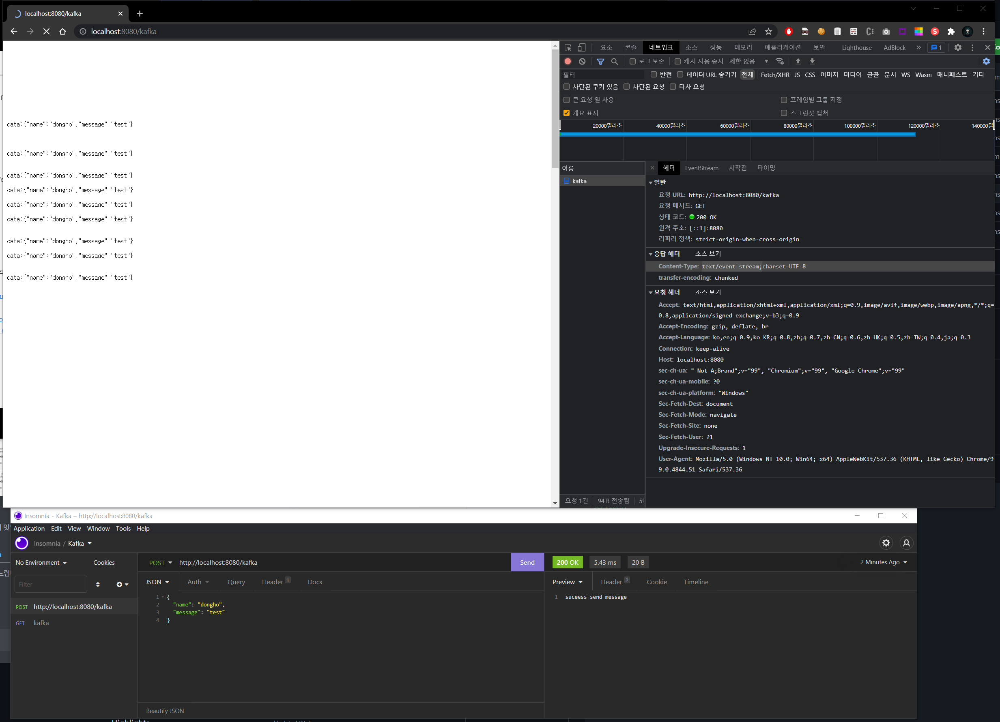

# 03/11 회의록

**회의록 작성자**

- 20163079 강동호
- 20171714 최주원

**회의 참여자**

- 20163079 강동호
- 20171714 최주원

**아이디어 구체화**

1. **Kafka Data Stream 을 이용한 API 게이트웨이 및 테스트 클라이언트 개발**

**금일 회의 요구 사항**

- 백엔드 Repository 분리해서 진행할지 정리
→ 사내 Github(Storelink-io)에 Repository OPEN 하고, 해당 Repository 만 Public 화해서 진행.
- 프론트엔드는 [Github.io](http://Github.io) 에서 SPA 프레임워크를 사용하여 정적으로 호스팅 진행
→ 정의된 Github.io Repository 에서 해당 SRC 확인 가능.
- (동호-백엔드) Kafka Streams 아키텍처 설계 및 개발
- (주원-프론트엔드) Docusaurous theme apply 및 회의록 Notion linking.

**기능**

- API 호출 목록 집합 - kafka
- API 테스트기
- 누락된 API 목록
- 처리된 API 목록
- 하루 처리량

**업무분담**

- **동호 - Kafka + Back-End**
    
    [https://github.com/storelink-io/friday-stream](https://github.com/storelink-io/friday-stream)
    
    
    

- **주원 - Front-End(React-Docusaurous)**
    
    [GitHub - kookmin-sw/capstone-2022-31 at docusaurous](https://github.com/kookmin-sw/capstone-2022-31/tree/docusaurous)
    
    
    

**기술스택**

- Spring Boot
    - Webflux
    - Kotlin
    - Reactive Kafka
- React
- Docusaurous
    - Document 제공 뿐만이 아니라, 실제 테스트 페이지까지 사용 예정.
        - 카프카 퍼블리셔 시각화
        - API 테스트 툴
    - 적용 - [https://kookmin-sw.github.io/capstone-2022-31/](https://kookmin-sw.github.io/capstone-2022-31/)
    - 후보테마
        - [https://remirror.io/](https://remirror.io/)
        - [Saving Photos to the Filesystem | Ionic Documentation (](https://ionicframework.com/docs/angular/your-first-app/saving-photos)[ionicframework.com](https://app.tryeraser.com/integration/gather/ionicframework.com)[)](https://ionicframework.com/docs/angular/your-first-app/saving-photos)

**회의 리뷰**

1. CTO님께 부분 오픈소스화 승인
    
    