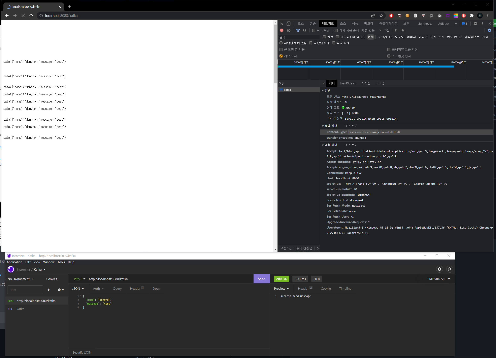

# 03/18 회의록

**회의록 작성자**

- 20163079 강동호
- 20171714 최주원

**회의 참여자**

- 20163079 강동호
- 20171714 최주원

**아이디어 구체화**

1. **Kafka Data Stream 을 이용한 API 게이트웨이 및 테스트 클라이언트 개발**

**금일 회의 요구 사항**

- React-Docusaurous 내에서 Notion 에서 작성한 markdown 문서 보여질 수 있도록 구현
- React-Docusaurous 스타일 변경 및 추가하고자 하는 데이터 논의 및 데이터 추가
- 중간 발표를 진행해야 하므로, 이와 관련된 PPT 제작

**기능**

- API 호출 목록 집합 - kafka
- API 테스트기
- 누락된 API 목록
- 처리된 API 목록
- 하루 처리량

**업무분담**

- **동호 - Kafka + Back-End**
    
    [https://github.com/storelink-io/friday-stream](https://github.com/storelink-io/friday-stream)
    
    
    

- **주원 - Front-End(React-Docusaurous)**
    
    [GitHub - kookmin-sw/capstone-2022-31 at docusaurous](https://github.com/kookmin-sw/capstone-2022-31/tree/docusaurous)
    
    
    

**기술스택**

- Spring Boot
    - Webflux
    - Kotlin
    - Reactive Kafka
- React
- Docusaurous
    - Document 제공 뿐만이 아니라, 실제 테스트 페이지까지 사용 예정.
        - 카프카 퍼블리셔 시각화
        - API 테스트 툴
    - 적용 - [https://kookmin-sw.github.io/capstone-2022-31/](https://kookmin-sw.github.io/capstone-2022-31/)
    - 후보테마
        - [https://remirror.io/](https://remirror.io/)
        - [Saving Photos to the Filesystem | Ionic Documentation (](https://ionicframework.com/docs/angular/your-first-app/saving-photos)[ionicframework.com](https://app.tryeraser.com/integration/gather/ionicframework.com)[)](https://ionicframework.com/docs/angular/your-first-app/saving-photos)

**회의 리뷰**

1. 어떤 데이터를 추가해야할 지에 대해서 추가적인 논의가 필요할 것 같음.